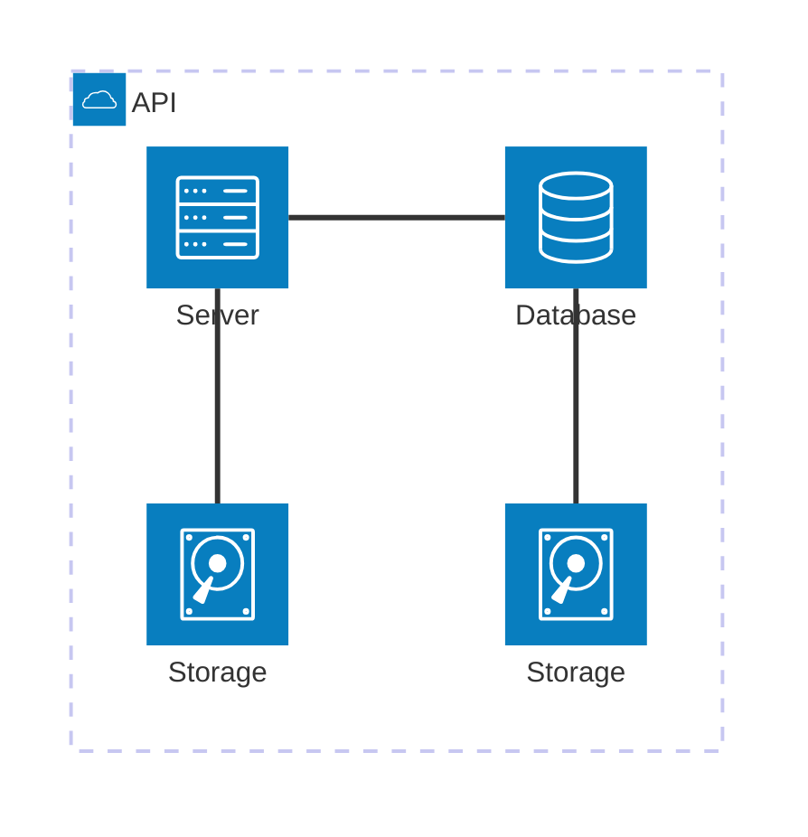

🎓 Academia del Dato
Bienvenido a la Academia del Dato, una plataforma educativa integral diseñada para potenciar habilidades tecnológicas. Este proyecto combina una landing page atractiva, un ecosistema de contenidos técnicos y un portal especializado para la gestión educativa.

🚀 Características Principales
Landing Page de Alto Impacto: Presentación de la oferta educativa y propuesta de valor de la academia.

Blog Especializado: Un espacio dedicado al aprendizaje continuo con artículos de actualidad tecnológica.

Tutoriales Técnicos: * Programación .NET: Guías desde nivel básico hasta avanzado utilizando C# y ASP.NET Core.

Análisis de Datos con Python: Implementaciones prácticas con bibliotecas como Pandas, NumPy y visualización de datos.

Portal IGER: Un módulo exclusivo integrado dentro del ecosistema para la gestión de servicios del instituto IGER.

🏗️ Estructura del Proyecto
A continuación, se detalla la jerarquía y navegación de la plataforma:

A continuación, se detalla la jerarquía y navegación de la plataforma:

🛠️ Tecnologías Utilizadas
Frontend: [Tu Framework: ej. React / Next.js / HTML5]

Backend: [Tu Stack: ej. .NET 8 / Node.js]

Base de Datos: MySql y Sql Server

Análisis: Python (Jupyter Notebooks, Scikit-learn)